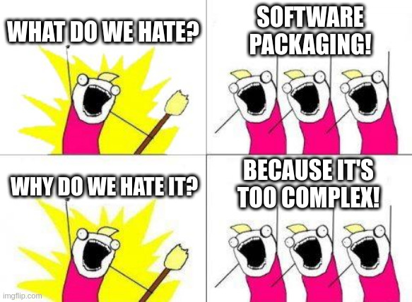
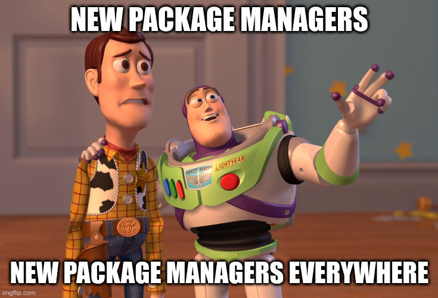

class: center, middle
name: motivation

# Motivation

---

## Motivation

.left-column[

User wollen:

- Stabilität
- **Aktualität**, funktionale Updates
- Benutzbarkeit
- **one-click**-Experience

]

.right-column[

]

---

## Motivation

.left-column[

Entwickler:innen wollen:

- Code schreiben.red[*]
- Fokus auf Funktionalität
- Testen von Erwartungen
- sich nicht mit Paketierung rumärgern

.footnote[.red[*] Nein! Doch! Ohh!]

]

.right-column[

]

---

## Klassische Paketverwaltung

.left-column[

- Die Auswahl ist groß:
  - RPM (*`yum`, `dnf`, `zypper`*)
  - DEB (*`apt`, `apt-get`*)
  - Arch (*`pacman`*)
  - `slackpkg`, `apk`, `nix`,...
- Ergänzende quellenbasierte.red[*] Paketmanager:
  - **AUR** (*Arch User Repository*)
  - CRUX Ports
  - **Portage** (*Gentoo Linux*)

]

.right-column[

.footnote[.red[*] Paket wird vor Installation kompiliert]

]

???

- Ubuntu PPA = **P**ersonal **P**ackage **A**rchive, persönliches DEB-Repository

---

class: small

## Qual der Wahl: Linux-Distributionen

|   | Releases | Wartung | Paketformat | Pakete.red[*] | Fokus |
| - | -------- | ------- | ----------- | ------ | ----- |
| Ubuntu | 6m bzw. 2y (LTS) | 9m bzw. 5-10y | DEB | ~34k | Aktualität, Stabilität |
| Debian | ~2y | 3-5y | DEB | ~32k | Stabilität |
| Fedora | ~6m | ~1y | RPM | ~23k | Aktualität |
| RHEL | ~3y | 10-13y | RPM | ~2.5k | Stabilität |
| Alma/Rocky Linux | ~3y | 10y | RPM | ~2.5k | Stabilität
| SLES | ~3y (major), ~1y (SP) | 10-13y | RPM | 13k | Stabilität, Aktualität |
| openSUSE Leap | ~3y (major), ~1y (SP) | 18m | RPM | 13k | Stabilität, Aktualität |
| openSUSE Tumbleweed | Rolling Release | 🤣 | RPM | 14k | Bleeding Edge 🔪🩸 |
| Arch | Rolling Release | 🤣 | PKG | 10k | Bleeding Edge 🔪🩸
| NixOS | ~6m | ~1y | Nix | ~71k | Bleeding Edge 🔪🩸 |

.footnote[.red[*] bezieht sich auf das Core-OS ohne zusätzliche Repositories]

---

## Status Quo

.left-column[

- Linux ist für viele Entwickler:innen eine zu komplexe Plattform:
  - Die Auswahl an Linux-Distributionen ist groß
  - Zahlreiche Paket-Manager
  - Es gibt zu unterschiedliche Versionsstände
]

.right-column[

Gäbe es doch nur eine Lösung dafür...

]

---

## "Neue" Paketmanager

.left-column[

- Drei Frameworks zur Problemlösung:
  - AppImage
  - Flatpak
  - Snapcraft
- werden parallel zum systemweiten Paketmanager verwendet
- verstehen sich als **Ergänzung** und nicht als Ersatz

]

.right-column[

]
