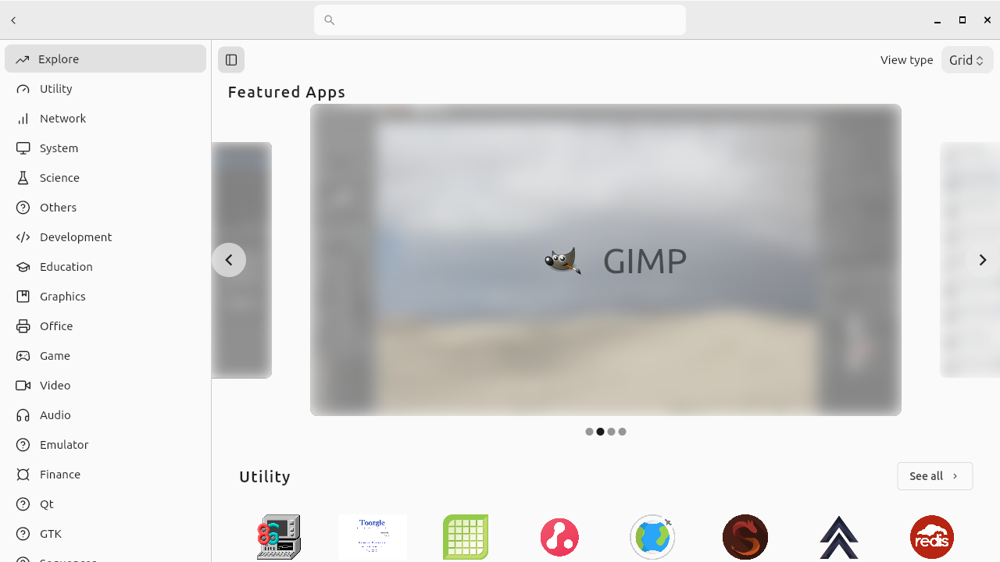
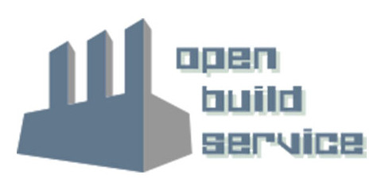

class: center, middle
name: appimage

# AppImage

---

## AppImage

.left-column75[

- 2004 von Simon Peter (*probonopd*) als **klik** gestartet
- Fokus auf Desktop-Anwendungen und -User
- benötigt keine Runtime
- **keine Installation** benötigt, einfach **ausführen**
  - analog zu `.exe`, `.dmg` und PortableApps
- SquashFS-Format.red[*], keine Sandbox-Umgebung
- keine Rechteverwaltung
- ca. **1.400** Anwendungen im zentralen [AppImageHub](https://appimage.github.io/apps/)

.footnote[.red[*] v2, v1 [nutzte ISO](https://discourse.appimage.org/t/alter-appimage-v1-convert-to-v2/2546/2)]

]

.right-column25[


]

???

- **nicht** für Admins designed
- läuft mit vollen Rechten des ausführenden Users
  - **nie** als Root ausführen

---

## AppImages ausführen

Heruntergeladene Datei ausführbar machen und starten:

```shell
$ chmod u+x DogeApp.AppImage
$ ./DogeApp.AppImage
```

Zur Interaktion mit dem Paketformat stehen verschiedene **Parameter** bereit:
- `--appimage-help` (Hilfe anzeigen)
- `--appimage-extract` (Paket entpacken)
- `--appimage-portable-home` (abweichender Pfad für `~`)
- `--appimage-portable-config` (abweichender Pfad für `~/.config`)

---

## AppImages verwalten

- Da AppImages einfach heruntergeladen und ausgeführt werden, gibt es keine **zentrale Verwaltung**
  - Philosophie: *one app = one file*

Abhilfe schaffen:
- [AppImageUpdate](https://github.com/AppImage/AppImageUpdate)
  - offizielles Tool
  - optionaler `appimaged`-Dienst, Rechtsklick im Panel zum Updaten
- [AppImage Pool](https://github.com/prateekmedia/appimagepool)
  - Flutter Store-UI

???

- Simon Peter beschreibt ein Feature von AppImage darin, einfach mehrere parallele Versionen einer Anwendung vorrätig haben zu können - das ginge nicht mit einer systemweiten Verwaltung
- Simon Peter sieht persönlich keinen Sinn in Stores, freut sich aber, wenn User AppImages integrieren

---

class: small, center, middle

### AppImage Pool



---

## Exkurs: DBUS-Portals

- **D**esktop-**Bus**, Bibliothek für Interprozesskommunikation
  - Teil von freedesktop.org, Bestandteil moderner Linux-Distributionen
- API-Definitionen zur Rechteverwaltung von Anwendungen, z.B.
  - `org.freedesktop.portal.Account` - Abfragen persönlicher Informationen
  - `.Camera` - Zugriff auf Webcams
  - `.Location` - Abfragen von Standort-Informationen
  - `.Screenshot` / `.ScreenCast` - Bildschirmfotos/-videos erstellen
  - `.FileChooser` - Dateien lesen/speichern

.footnote[.red[*] vollständige Liste siehe [hier](https://flatpak.github.io/xdg-desktop-portal/)]

---

## Anatomie eines AppImages

```shell
HannahMontanaApp.AppDir/                    # Anwendungsverzeichnis
HannahMontanaApp.AppDir/AppRun              # Start-Skript/-Programm
HannahMontanaApp.AppDir/myapp.desktop       # Desktopverknüpfung
HannahMontanaApp.AppDir/myapp.png           # Desktop-Icon
HannahMontanaApp.AppDir/usr/bin/myapp       # Anwendung(en)
HannahMontanaApp.AppDir/usr/lib/libfoo.so.0 # Bibliothek(en)
```

Auf GitHub existiert ein [AppRun](https://github.com/AppImage/AppImageKit/blob/master/resources/AppRun)-Beispiel:

- setzt verschiedene Umgebungsvariablen
  - `PATH`, `LD_LIBRARY_PATH`, `PYTHONPATH`, `XDG_DATA_DIRS`, `PERLLIB`, `GSETTINGS_SCHEMA_DIR`, `QT_PLUGIN_PATH`
- führt Anwendung (anhand `.desktop`-Datei) aus

---

## Erstellen eines AppImages

Es gibt verschiedene Optionen:

1. Open Build Service
2. Bestehende Binärpakete konvertieren
3. Travis CI benutzen
4. `linuxdeployqt` für Qt-Anwendungen
5. `electron`-builder für Electron-Anwendungen
6. Manuell Ordnerstruktur erstellen und konvertieren

---

## Open Build Service

.left-column75[

- empfohlen für Open Source-Projekte
- Service zur automatisierten Paket-Erstellung
- **openSUSE Build Service**: für OSS kostenlose Instanz
  - kann auch [selbst gehostet](https://openbuildservice.org/download/) werden
- **automatisches** Neubauen falls ebenfalls auf OBS gehostete Abhängigkeiten neue Versionen erstellen
- **automatisches Signieren** mit User Key
- bettet Update-Informationen ein um **Binärdelta-Updates** zu ermöglichen

]

.right-column25[



]

???

- OBS-Feature existiert seit 2017

---

## Binärpakete konvertieren

[`pkg2appimage`](https://raw.githubusercontent.com/probonopd/AppImages/master/pkg2appimage)-Skript erleichtert das Konvertieren von Binärpaketen:

- lädt Binärdateien von Debian-Repositories oder Webseiten herunter
- führt **Skripte** aus, um Daten anzupassen
- **erstellt** anschließend ein AppImage-Abbild
- Konfiguration via **YAML**-Datei, fertige Vorlagen (**Recipes**) auf [GitHub](https://github.com/AppImage/pkg2appimage/tree/master/recipes)
- erfordert Kenntnisse über die Struktur des Pakets

---

class: small

### Beispiel: ZDoom

```yaml
---
app: zdoom
union: true

ingredients:
  dist: precise
  sources:
    - deb http://us.archive.ubuntu.com/ubuntu/ precise main universe multiverse
    - deb http://us.archive.ubuntu.com/ubuntu/ precise-updates main universe multiverse
    - deb http://debian.drdteam.org/ stable multiverse
  script:
    - wget -c https://github.com/freedoom/freedoom/releases/download/v0.11.1/freedoom-0.11.1.zip
    - unzip freedoom-*.zip
script:
  - mv -f opt/zdoom/* usr/bin/
  - mkdir -p usr/share/games/doom
  - mv ../freedoom-*/* usr/share/games/doom/
```

`zdoom.yml` - [Quelle](https://discourse.appimage.org/t/how-to-create-an-appimage/155/12)

---

### Beispiel: ZDoom

Konvertieren des Pakets:

```shell
$ pkg2appimage zdoom.yml
...
Embedding ELF...
Marking the AppImage as executable...
Embedding MD5 digest
Success
...
-rwxr-xr-x 1 cstankow cstankow  23M Aug  4 17:50 ../out/ZDoom-2.8.1.glibc2.15-x86_64.AppImage
```

---

## Manuelle Ordnerstruktur

- Ordnerstruktur lässt sich manuell erstellen
- Konvention: `$anwendung.AppDir`
- benötigt [`appimagetool`](https://github.com/AppImage/AppImageKit/releases) zum Erstellen des Images

---

class: small

### Beispiel

Entpacken einer Debian-Datei, Erstellen der Ordnerstruktur:

```shell
$ mkdir leafpad ; cd $_
$ curl -O http://ftp.de.debian.org/debian/pool/main/l/leafpad/leafpad_0.8.18.1-5_amd64.deb
$ mkdir leafpad.AppDir ; cd $_
$ dpkg -x ../leafpad*.deb .
$ cp usr/share/icons/hicolor/32x32/apps/leafpad.png .
$ cp usr/share/icons/hicolor/scalable/apps/leafpad.svg .
$ cp usr/share/applications/leafpad.desktop .
$ curl -O https://raw.githubusercontent.com/AppImage/AppImageKit/master/resources/AppRun
$ tree
.
├── AppRun
├── leafpad.desktop
├── leafpad.png
├── lib
    ...
└── usr
    ...
```

---

### Beispiel

Erstellen des Abbilds:

```shell
$ cd ..
$ appimagetool leafpad.AppDir
appimagetool, continuous build (commit 729a1a6), build <local dev build> built on 2022-08-03 00:24:06 UTC
Using architecture x86_64
...
Embedding ELF...
Marking the AppImage as executable...
Embedding MD5 digest
Success
```

---

## Generelle Tipps

- AppImages sollten alle benötigten Bibliotheken und Abhängigkeiten enthalten, die **nicht** zur Grundinstallation gehören
- Auf dem ältesten System kompilieren, das unterstützt werden soll.red[*]
  - insbesondere `glibc`-Abhängigkeiten können Probleme machen
- Auf unterstützten Systemen ausgiebig testen
- keine hardkodierten Pfade verwenden
- siehe auch Dokumentation im [AppImage-Wiki](https://github.com/AppImage/AppImageKit/wiki/Creating-AppImages)

.footnote[.red[*] ältestes supportetes LTS-Release oder zumindest `$current-1`]

???

- einige AppImages wurden lange auf CentOS 6 erstellt
