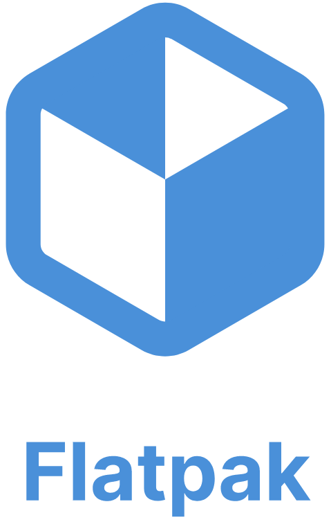
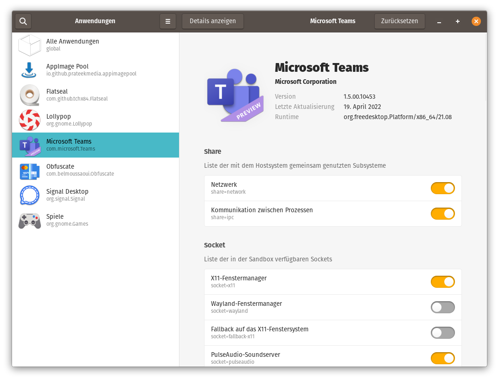

class: center, middle
name: flatpak

# Flatpak

---

## Flatpak

.left-column75[

- 2007 erstmalig als **Glick** vorgestellt.red[*]
- seit 2016 als Flatpak bekannt
- Fokus auf Desktop-Anwendungen
- benötigt Runtime
- Installation benötigt
- startet Anwendungen in **Sandbox**-Umgebung
  - Rechteverwaltung via **XDG-Portals**
  - Konfiguration über DE oder [Flatseal](https://github.com/tchx84/Flatseal)

.footnote[.red[*] spätere Iterationen hießen _Glick 2_, _bundler_ und _xdg-app_]

]

.right-column25[



]

---

## Flatpak

.left-column75[

- verwendet **OSTree**- oder OCI-Images
- ca. 1700 Anwendungen auf [Flathub](https://flathub.org/)
  - **dezentrale** Stores vorhanden (elementaryOS, Pop!_OS)
- Updates als neues Images
- derzeit auf [33 Distributionen](https://flatpak.org/setup/) unterstützt
  - auf einigen schon vorinstalliert

]

.right-column25[


]

---

## Flatpak einrichten

Flatpak-Runtime installieren:

```shell
# yum install flatpak
# apt-get install flatpak
# zypper install flatpak
# pacman -S flatpak
```

Store hinzufügen:

```shell
$ flatpak remote-add --if-not-exists flathub https://flathub.org/repo/flathub.flatpakrepo
```

Anwendungen installieren:

```shell
$ flatpak install flathub com.github.tchx84.Flatseal
```

---

class: small, center, middle

### Flatseal



---

class: small, center, middle

### Integration in Pop!_Shop


---

## Flatpak erstellen

- TODO: SDK
- TODO: Beispiel

- TODO
- TODO
