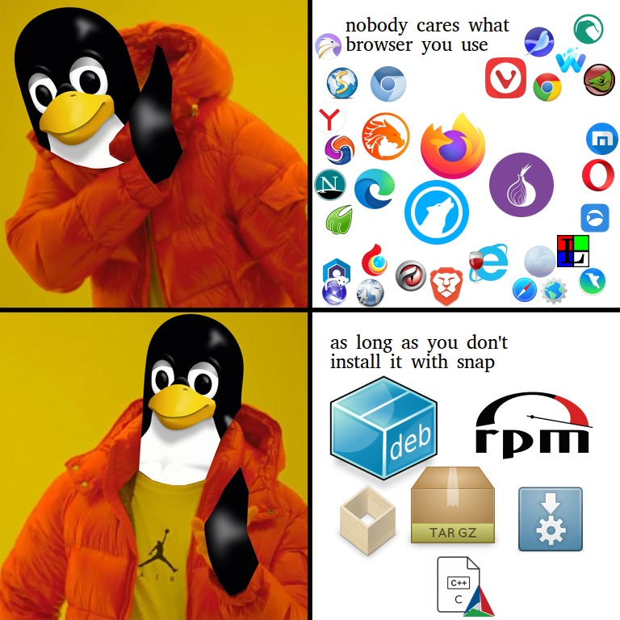

class: center, middle
name: outro

# Ausblick

---

class: small

## Zusammenfassung

| | AppImage | Flatpak | Snapcraft |
| - | -------- | ------- | --------- |
| Erschienen | 2004 | 2007 | 2014 |
| Autor:in | Simon Peter, Community | Flatpak-Team | Canonical |
| Fokus | Endanwender:innen | Desktop | Desktop, Dienste, Drucker |
| Runtime benötigt? | Nein | Ja | Ja |
| Installation notwendig? | Nein | Ja | Ja
| Sandbox | Nein | Ja | Ja |
| Format | SquashFS | OSTree/OCI | SquashFS |
| Rechteverwaltung | Nein | Ja (XDG) | Ja (XDG, AppArmor) |
| Store | [AppImageHub](https://appimage.github.io/apps/) | [Flathub](https://flathub.org/) | [Snapcraft](https://snapcraft.io/) |
| Angebot | ca. 1.400 Apps | ca. 2.300 Apps | ¯\\_(ツ)_/¯ |
| Updates | Neues Image bzw. Binary Delta | Neues Image | Transaktionale Updates |

---

## Fazit

- AppImage ist für Desktop-Apps die **schlankste** und einfachste Lösung
- Flatpaks sind weit verbreitet, integrieren sich in **Software-Shops**
- Snapcraft kämpft mit technischen Details und Akzeptanz
- Canonical hätte **proaktiver**/schneller auf Feedback eingehen müssen
- Quelloffen + Dezentral > Proprietäre Shops
- Umweg über Multipass/LXD unnötig **komplex**
- Web-Browser sind kritische Anwendungen, die weiterhin vom Distributor ausgeliefert werden sollten

---

class: center, middle

---

## Links

- [AppImage-Wiki zur Paketierung](https://github.com/AppImage/AppImageKit/wiki/Creating-AppImages)
- [AppImageHub](https://appimage.github.io/apps/)
- [Interview mit Simon Peter](https://itsfoss.com/appimage-interview)
- [SUSECON 2017-Vortrag über AppImage](https://speakerdeck.com/probonopd/opensuse-conference-2017-obs-b-appimage)
- [Flathub](https://flathub.org/)
- [Flatpak-Dokumentation](https://docs.flatpak.org/en/latest/)
- [Flatpak-Tutorial](https://docs.flatpak.org/en/latest/first-build.html)
- [Snapcraft](https://snapcraft.io/)
- [Snapcraft-Dokumentation](https://snapcraft.io/docs)
- [Snap Hello World](https://snapcraft.io/first-snap)

---

## FOCUS ON: Linux

.left-column[

Themen wie diese könnt ihr hier alle 2 Wochen hören:

- News des Monats
- Tooltipps
- Thematische Sonderfolgen

Verfügbar via:

- [RSS](https://ageofdevops.de/feed/podcast/fol) / [fyyd](https://fyyd.de/podcast/focus-on-linux)
- [Apple Podcasts](https://podcasts.apple.com/us/podcast/focus-on-linux/id1606139089)
- [Spotify](https://open.spotify.com/show/4Yj9EaidQuwEZL0NkAafzh)

]

.right-column[

]

---

class: center, middle

## Danke für die Aufmerksamkeit

### (Fragen?)

